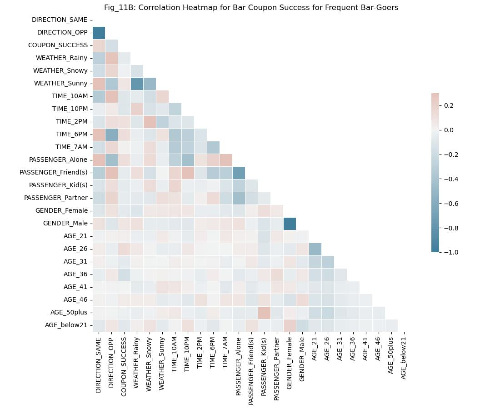
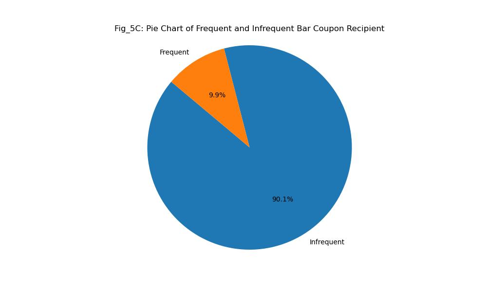
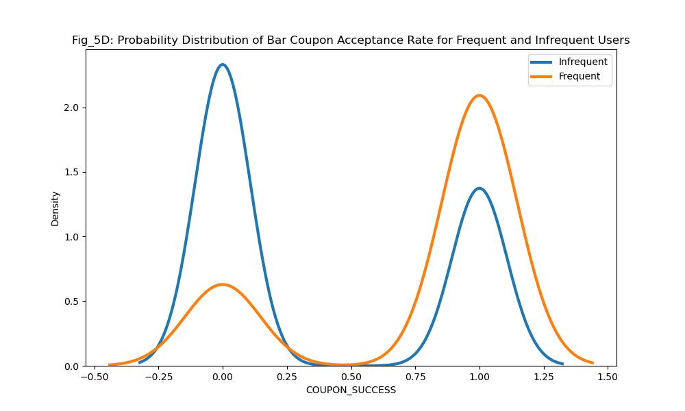
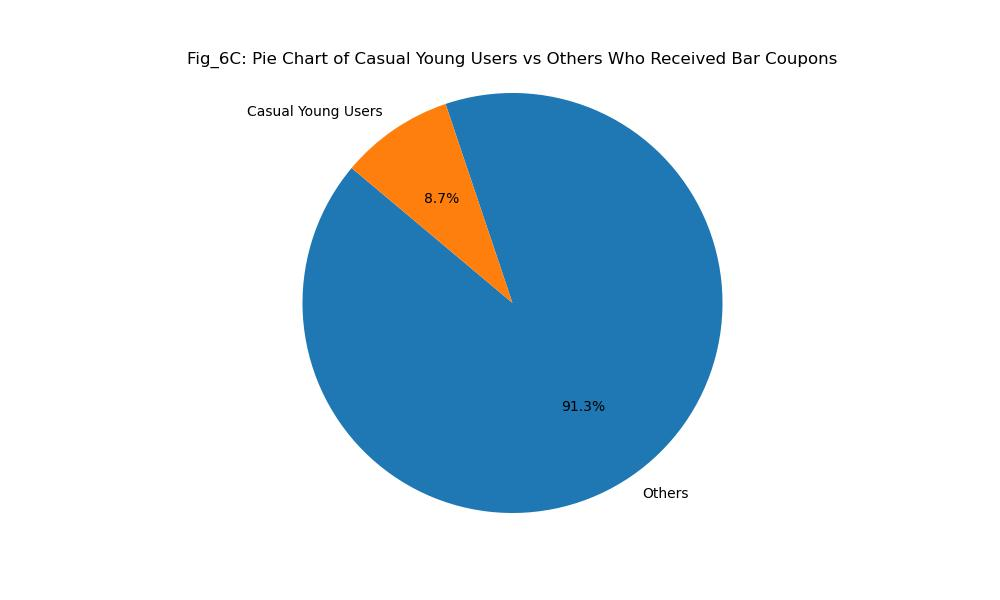
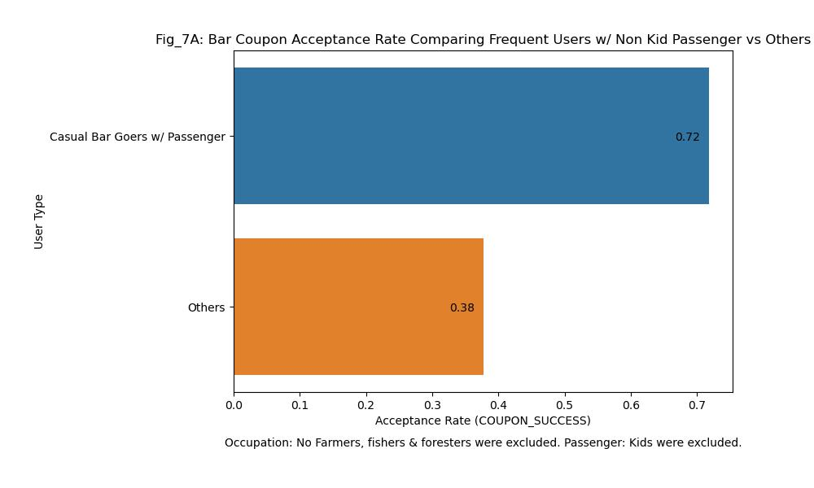
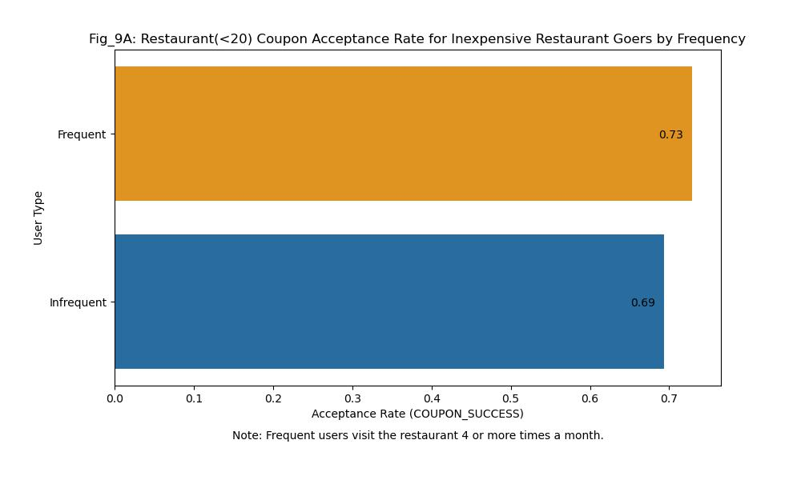
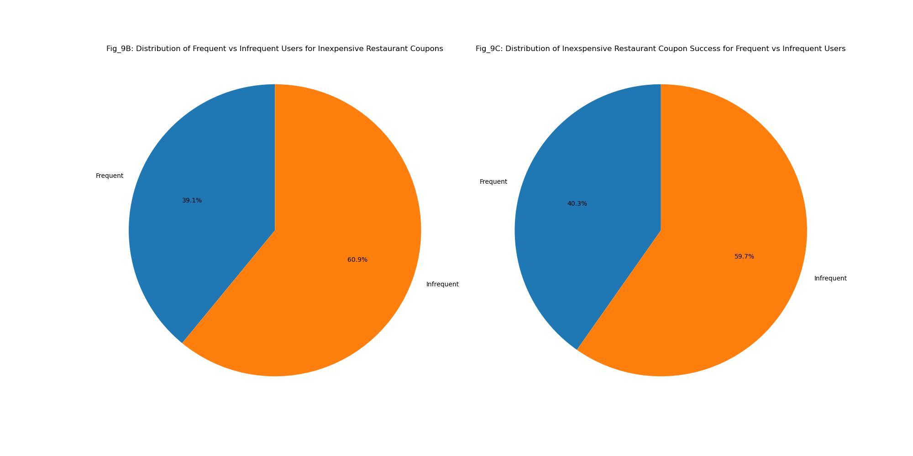

# Will a Customer Accept the Coupon?

## Harnessing the Power of BI Analytics: An Exploration using Correlation Matrices, Python DataFrame Queries and Seaborn Visualization Plots

## 1. Introduction

In the dynamic landscape of today's consumer market, understanding customer behavior is paramount. A coupon is a great excuse to communicate with a customer, dramatize timely opportunities and promote new or popular products. [In 2019, 92% of consumers used coupons when shopping, according to a Statista survey of 1,000 people.](https://www.forbes.com/sites/forbestechcouncil/2020/10/08/five-ways-coupons-can-help-your-business-attract-loyal-customers/) So coupons and the acceptance thereof is serious business.

This project delves into the intriguing question of what influences a driver's decision to accept a coupon delivered to their cell phone while on the road based on geofencing triggers. Is it the type of establishment - a restaurant, a bar, or a coffee house? Does the presence of passengers, the weather, or the time of day sway the decision?

To unravel these complexities, we embark on an exploratory journey through a rich dataset sourced from the [UCI Machine Learning repository, collected via a survey on Amazon Mechanical Turk.](https://archive.ics.uci.edu/dataset/603/in+vehicle+coupon+recommendation) The survey captures a variety of driving scenarios and the driver's decision to accept or reject a coupon under those circumstances.

Our analysis employs a systematic approach, beginning with a comparative study of different coupons using bar plots. This visual exploration aids in discerning patterns and trends across coupon types. We then delve deeper, constructing a correlation matrix for coupon types to iEarly morning sunny days, especially when your partner is in the car, are prime times for coupon acceptance. Specifically targeting these conditions for coffee house lovers might just result in a winning campaign.dentify potential areas of interest. Finally, we perform targeted comparisons by querying the data, investigating how different combinations of features influence the coupon acceptance ratio. Some of the tools we'll use are descriptive statistics, one hot encoding, correlation heatmaps, pandas dataframe queries, and violin plots.

[This exploration was performed in this Jupyter Notebook. There you will find the Python source code for all the graphs in this report.](https://github.com/elmunoz42/berkeley-aiml-coupon-analysis/blob/main/prompt.ipynb)

This project not only aims to distinguish between customers who accepted a driving coupon versus those who did not, but also seeks to provide insights that could inform targeted marketing strategies and enhance customer engagement. The findings from this analysis will be presented in a comprehensive report, highlighting key insights and actionable recommendations.

It is important to note that much more analysis is possible with this dataset. We had to make choices and explore certain scenarios in depth but not others. Specifically, we only looked at the Coffee House, Restaurant(<20) and Bar coupons. With a deeper dive on the Bar coupon.

## 2. Data Overview

The dataset used in this analysis is a rich collection of information detailing various driving scenarios and the driver's decision to accept or reject a coupon under those circumstances. The data, sourced from the UCI Machine Learning Repository, provides a comprehensive view of the factors that might influence a driver's decision to accept a coupon.

The dataset comprises three main categories of attributes:

### User Attributes

These attributes provide demographic information about the users, including their gender, age, marital status, number of children, education, occupation, and annual income. It also includes lifestyle information such as the frequency of visits to bars, coffee houses, and restaurants with an average expense of less than $20 per person.

### Contextual Attributes

These attributes describe the context in which the coupon was offered. They include general information about the location of the user, the coupon venue, and the destination. They also detail the weather conditions, temperature, time of day, and the presence of passengers in the vehicle.

### Coupon Attributes

These attributes provide information about the coupon itself, including the time before it expires.

This diverse set of attributes allows for a comprehensive analysis of the factors influencing a driver's decision to accept a coupon. The subsequent sections will delve into a detailed analysis of these attributes and their impact on coupon acceptance.

## 3. Methodology

Our approach to analyzing this dataset involved several key steps to ensure the data was clean, relevant, and ready for analysis.

### Data Cleaning

The first step in our methodology was data cleaning. This involved:

- **Removing columns with excessive missing data**: Columns with too many missing values can skew the analysis and lead to inaccurate results. We identified such columns and removed them from our dataset.

- **Handling null values**: We also dealt with null values in our dataset. Depending on the nature of the data and the extent of the null values, we either filled them with appropriate values or removed the rows containing these null values.

- **One-hot encoding**: For categorical variables, we used one-hot encoding. This technique transforms a category value into a new column and assigns a 1 or 0 (True/False) value to the column. This method is effective for handling categorical data without imposing an arbitrary order on the categories.

- **Descriptive labeling**: When necessary, we’ve corrected spelling errors or added more descriptive labels.

### Data Analysis Methodology

Once the data was cleaned, we moved on to the analysis phase. This involved:

- **Data Exploration**: We began our analysis by exploring the data using bar graphs. This helped us understand the distribution of different variables in our dataset and identify any noticeable trends or patterns.

- **Correlation Matrix**: We used a correlation matrix to understand the relationship between different variables in our dataset. This helped us identify patterns and trends in the data, and guided our subsequent analysis. We leveraged the Seaborn heatmap plots and Seaborn bar plots to aid in visualization of the statistical data.

- **Data Queries**: We performed targeted queries on our pandas dataframe to investigate specific combinations of features and their impact on coupon acceptance. The Pandas queries functions were utilized in combination with Seaborn violin and bar plots. Matplotlib pie charts were also utilized to help visualize the comparative size of certain populations.

This systematic approach allowed us to thoroughly explore the dataset and derive meaningful insights from it.

## 4. Analysis

### Overall Analysis:

The key question of this data analysis is "Will a Customer Accept the Coupon?" and the answer is simply: "Yes! A majority of time the time (56.8%) coupons are succeding in being accepted by drivers and converting into meaningful business activity, but the acceptance rate greatly depends on a variety of circumstances." Any given coupon's performance - which we'll refer to as acceptance rate and coupon success henceforth - is greatly affect by weather, the direction the driver is headed (away from home or towards their home), how frequently they use that type of service etc. Throughout our analysis we describe some of these tendencies in greater detail. We've explored primarily the Bar coupons because those were underperforming when compared to other coupons. We'll explore how the data provides some specific insights using Jupyter Notebook, Pandas Dataframes and the Seaborn and Matplotlib data visualization libraries.

### Data Review and Cleanup

#### Dimensionality of the Data Set

The dataset under examination comprises 12,684 samples and 26 distinct features, providing a robust foundation for comprehensive analysis. The features are a mix of categorical and integer types. The majority of features have categorical data, which will at some points present issues that warrant the use of one hot encoding.

The dataset’s multivariate nature allows for the investigation of relationships between multiple variables simultaneously, thereby enabling a more nuanced understanding of the underlying patterns. Given the substantial number of instances and the variety of features, this dataset provides ample opportunities for thorough exploration and analysis in the realm of business intelligence.

#### Missing Values

As described in the [Dataset documentation](https://archive.ics.uci.edu/dataset/603/in+vehicle+coupon+recommendation) the data was gathered using surveys by Amazon Mechanical Turk. Although the survey is very complete, when we plot for missing values we do find some issues nonetheless. See Fig_1:

#### Fig_1: Missing Value Ratio per Column (Sorted)

This figure provides a visual representation of the missing value ratio for each column in the dataset, sorted in descending order. It's clear from the plot that the 'Car' column has a significant amount of missing data, with approximately 99.14% of its values missing. This high percentage of missing values may impact the reliability of any analysis involving this column.

On the other hand, the columns 'CoffeeHouse', 'Restaurant20To50', 'CarryAway', 'RestaurantLessThan20', and 'Bar' have less than 10% of their values missing. This relatively low percentage of missing values suggests that these columns are more complete and may provide more reliable insights for analysis.

The missing value ratio is an important factor to consider during data cleaning and preprocessing, as it can significantly impact the results of the analysis.s.

#### Data Cleanup Steps

For the 'CoffeeHouse', 'Restaurant20To50', 'CarryAway', 'RestaurantLessThan20', 'Bar' it will suffice to replace the null values with the value "Unknown". By adding this value we leave the door open for a pattern to emerge for these unknown entries in future analysis, if there happend to be one. If for example a specific demographic disproportionately had a value set as "Unkonwn" there might be more going on.

The 'car' column on the other hand has more than 99% of data marked as null and is therefore not useful, so we will remove that column from the dataset. It might have been an issue with the user interface or form the user was presented with.

Additionally, I've standardized the titles to use snake case and all caps. Later in the analysis we'll use one hot encoding and the dummy columns will have all caps for the parent column name and Capitalized for the variant for example: "WEATHER_Snowy". This allows us to distinguish between original columns (in this case it was "WEATHER") and the variations thereof.

Finally, the "passanger" column was corrected to "PASSENGER" and the acceptance of a coupon by a driver was called the "Y" column and that has been changed to "COUPON_SUCCESS" to be more descriptive.

### Initial Analysis

As an initial step we want to compare the average coupon success (or acceptance rate) of the different coupons. We can accomplish that by using a Seaborn bar plot.

#### Fig_2: Acceptance Rate of Different Types of Coupons

As observed in the data, Carry Out & Take Away is the most accepted type of coupon, followed by Restaurant(<20). This insight could be valuable for businesses in tailoring their coupon strategies to customer preferences.

You can also see the error bars for each coupon. These provide a visual representation of the statistical uncertainty or variability in the acceptance rate for each coupon type. The length of these lines indicates the range within which the true population mean is likely to fall, given the sample data. Seaborn's barplot function uses a 95% confidence interval.

In summary, the narrower the black rectangle (error bar), the more predictable or consistent the acceptance ratio is for that coupon type. As you can see, the 'Bar' coupon has the lowest acceptance rate and is also very unpredictable.

#### Statistical Analysis of Coupon Acceptance Rates Across Different Categories

The descriptive statistics point to the fact that the "Coffee House" coupons have by far the highest accepted coupon count 3996, but the mean coupon acceptance rate is the highest in the in the "Carry out & Take away" coupons. The lowest count of accepted coupons is the "Restaurant(20-50)" coupon for more expensive restaurants, the lowest mean is the Bar coupon. If a coupon type has a high acceptance rate but not a high count that might mean that there is a business opportunity to compete in that particular service. Conversely, the opposite might mean the market is saturated. The fact that the standard deviation is highest for the Coffee House coupon further illustrates how the count of successes is high but the ratio of success is lower, there is more variation in the results for this coupon than the others. This could be an area for further investigation to understand the factors contributing to this variability.

| Stat  | Restaurant(<20) | Coffee House | Carry out & Take away | Bar      | Restaurant(20-50) |
| ----- | --------------- | ------------ | --------------------- | -------- | ----------------- |
| count | 2786            | 3996         | 2393                  | 2017     | 1492              |
| mean  | 0.707107        | 0.499249     | 0.735478              | 0.410015 | 0.441019          |
| std   | 0.455171        | 0.500062     | 0.441170              | 0.491958 | 0.496676          |
| min   | 0               | 0            | 0                     | 0        | 0                 |
| 25%   | 0               | 0            | 0                     | 0        | 0                 |
| 50%   | 1               | 0            | 1                     | 0        | 0                 |
| 75%   | 1               | 1            | 1                     | 1        | 1                 |
| max   | 1               | 1            | 1                     | 1        | 1                 |

#### Next Steps: Areas of Interest for our Exploration of the Data

Based on the insights of the Fig_2 and Statistical Description table we are going to focus on the "Coffee House", the "Restaurant(<20)" and the "Bar" coupons. There is much else that could be explored with this data, but in the interest of brevity we'll focus on these three. The "Coffee House" coupon is interesting because of the high standard deviation number, "Restaurant(<20)" is interesting because it is a high performer especially compared to "Restaurant(20-50)" and finally the "Bar" coupons perform badly and we want to eplore that part of the dataset to see if there are some possible reasons why.

In addition, our analysis will strategically focus on specific features of the dataset. For each coupon type, we will select a subset of columns from the dataframe that appear to hold potential for insightful findings. It’s important to note that this approach does not encompass an exhaustive analysis of all available data. Our objective is to efficiently utilize our resources to investigate potential relationships and derive meaningful insights.

### Correlation Analysis

A good first step in analyzing different features of a dataset is to check for correlations. Since our principal focus is coupon success we'll begin by visualizing the correlation of some features against coupon success for each of our target coupon types. Please note that hot one encoding has been used to turn categorical data into booleans (in 0, 1 format). This in turn allows us to better understand the correlations between for example sunny weather ("WHEATHER_Sunny") and the coupon acceptance rate.

#### Fig_10A: Correlation of Features with Inexpensive Restaurant Coupon Success for Frequent Goers

This graph compares the correlation between features and the coupon success for users that are already frequent inexpensive restaurant goers. As you can see sunny weather correlates strongly with coupon usage. Conversely, if the coupon is received after 10pm at night it is a lot less likely to convert. Interestingly, if a driver is going the opposite direction they are more likely to want to use a coupon. This might be because the they are going the opposite way might have to do with having a passenger onboard, or running some errand and thus needed to make alternate plans for a meal since home is becoming further away as they go. But, this also gives us a clue at another way to explore the data which is to look at the correlations of features with eachother. Even though we are ultimately interested in the relationships that lead to coupon success, by exploring how features influence eachother we could discover combinations that have a stronger correlation coefficient to coupon success than a single feature alone.

#### Fig_10B: Correlation Heatmap for Inexpensive Restaurant Coupon Success for Frequent Goers

This is a different visualization for the same population as Fib_10A. If we look at the above correlations we can see that the strongest correlations are obvious negative ones. For example passenger_Friend(s) and passenger_Alone are mutually exclusive, it isn't possible to have selected both. Hence they are dark blue.

Now for the more interesting patterns you see that when a driver has a kid(s) or a friend(s) in their car they are more likely to be going away from their house. Perhaps the reason to be driving away from home is to give them a ride to a destination or for an outing together. Additionally, it is more likely than not that the weather would be sunny under those conditions, since these values correlate with eachother. This leads us to a valuable business insight. There is a powerful combination of factors when its sunny, you have friend or kids in the car and you are going away from home, perhaps for a fun outing that deserves celebration at an inexpensive restaurant. Whatever the exact reasons might be (soccer practice commute, errand, theme park outing etc. ) there could be value in targetting drivers in this particular predicament with context appropriate personalized messaging.

One additional note is that the most popular times for coupon acceptance is 2pm and 6pm. Perhaps because drivers are about to get off of work or get ready for dinner.

#### Fig_11A: Correlation of Features for Bar Coupon Success for Frequent Bar-Goers

This figure examines the correlation coefficients for frequent bar-goers to assess their conversion rates under various conditions. As you can see, age plays a significant role. Drivers aged 21 and 26 are much more likely to convert. This trend changes dramatically for drivers in their 30s. Interestingly, the direction of travel has a different impact compared to the Restaurant(<20) coupons we previously reviewed. Drivers are much more likely to visit a bar if it’s on their route. Conversely, the likelihood of visiting a bar decreases if they are alone. If they are alone, there is a positive correlation with accepting the bar coupon. We will further query the data to explore these relationships in greater depth.

#### Fig_11B: Correlation Heatmap for Bar Coupon Success for Frequent Bar-Goers

Similar to Fig_10B, this heatmap allows us to examine correlations between different features, unveiling intriguing combinations.

For example, observe that drivers aged 50 or above are more likely to have a child in the car, which ultimately diminishes the likelihood of them accepting a coupon.

Interestingly, if a driver is 26 years old, they are more likely to receive the coupon (and thus be out driving) at 10pm at night. However, the coupon acceptance rate at 10pm is lower than usual, suggesting there may be additional factors at play.

In the queries section later in this report, we will conduct a deeper exploration into the relationships between passengers, time of day, weather, and more, with a particular focus on the "Bar" coupon. This in-depth analysis aims to shed further light on the factors influencing coupon acceptance.

- Discuss the correlation matrix for the Bar, Inexpensive Restaurant, and Coffee House coupons.

- Deep dive into the bar coupons and specific populations. Discuss how their coupon acceptance ratio differs from other users.

#### Fig_12A: Correlation of Features for Coffee House Coupon Success for Frequent Goers

As you might expect, coupons are much more likely to be successful at 10am in the morning than at 10pm at night. Many people find the effects of coffee to be beneficial at the start of the day and detrimental at night, so this is not surprising.

For this coupon, having your partner present in your car has a higher positive correlation than any other passenger. Being alone is negatively correlated with accepting the coupon.

Weather does seem to play a role, with sunny weather being the most favorable to coupon success.

#### Fig_12B: Correlation Heatmap for Frequent Coffee House Goers

As observed earlier, the success of a coupon correlates positively with instances where drivers have a partner in the car. Interestingly, this scenario also correlates with the time being 10am. This suggests a potent combination of factors that could enhance the likelihood of coupon acceptance.

Moreover, sunny weather appears to correlate positively with coupon acceptance. This correlation is also observed when one or more friends are present in the car. This combination of factors seems to contribute significantly to the success of the coffee shop coupon. These insights could be instrumental in strategizing effective coupon campaigns.

### High Level Comparisons of The Coupon Types by the "TEMPERATURE" Feature

This is a quick example of how certain findings in the data can be further investigated by drilling down on a Pandas query condition.

#### Fig_3: Acceptance of Coupons by Temperature Value

As you can see, the highest temperature of 80 degrees resulted in more than twice the coupon adoption. As a follow-up, let’s investigate that temperature and see what the most popular coupons are at 80 degrees.

#### Fib_4: Coupon Acceptance in High Temperature by Coupon Name Analysis

Interestingly, the inexpensive restaurant ("Restaurant(<20)") and the "Carry out & Take Away" coupons are the most popular in high heat conditions. Surprisingly, the Bar coupon has the best performance. One might assume that people would seek refreshment at a bar to cool down, but the data does not support this assumption. Based on this data analysis, it appears that people may prefer not to cook in a hot kitchen and would rather be in a temperature-controlled restaurant or opt for takeout that doesn’t require laborious cooking. Another consideration, based on what we observed in Fig_10A, is that the success of inexpensive restaurant coupons correlates with the 2pm and 6pm time slots, which are typically the hottest times of the day. Therefore, the temperature might just be a byproduct of the time of day, or it could be that the time of day is a result of the heat being the driver.

Of course, the data does not provide a definitive explanation for these two coupons’ exceptional performance or the causation of the high heat coupon success. Whatever the actual reason for this performance, it is clear that the coupons are particularly effective. Firstly, the coupons in general are much more effective on hot days, and secondly, they are especially effective for carryout and inexpensive restaurants. This analysis provides valuable insights into the factors influencing coupon acceptance. Furthermore, this demonstrates how we can drill down on certain features.

### Dataframe Queries Using Various Data Visualization Plots

#### Fig_5A: Bar Coupon Acceptance Rate for Frequent Bar-Goers Compared to Infrequent

As evident from this bar plot, the acceptance rate for frequent bar-goers is significantly higher at 77% compared to that of infrequent bar-goers at 37%.

#### Fig_5B: Violin Plot of Bar Coupon Acceptance Rate for Frequent and Infrequent Bar-Goers

This violin plot compares the "COUPON_SUCCESS" between "Frequent" and "Infrequent" users. The plot shows that "Frequent" users generally have a higher success rate (closer to 1), with a narrower distribution indicating less variability in their responses. On the other hand, "Infrequent" users show a wider distribution of success rates, with a peak closer to 0, indicating more variability and generally lower success rates.

##### Note about IQR:

The central rectangular black bar of each violin plot represents the Interquartile Range. The Interquartile Range (IQR) is a measure of statistical dispersion, or in simpler terms, it’s a measure of how spread out the values in a data set are around the median.

If the IQR is smaller for "Frequent" users, it means that the middle 50% of "COUPON_SUCCESS" values for "Frequent" users are more closely grouped around the median. In other words, "Frequent" users have less variability in their "COUPON_SUCCESS" values compared to "Infrequent" users.

This could suggest that the behavior of "Frequent" users is more predictable when it comes to coupon success, as their responses are less spread out. On the other hand, "Infrequent" users might have a wider range of behaviors or responses to coupons, as indicated by the larger IQR. Let me know if you need further assistance!

#### Fig_5C: Pie Chart of Frequent and Infrequent Bar Coupon Recipient

This plot compares "COUPON_SUCCESS" for "Frequent" and "Infrequent" users. "Frequent" users that receive the coupon are a smaller population 9.9% of the all who receive bar coupons.

#### Fig_5D: Probability Distribution of Bar Coupon Acceptance Rate for Frequent and Infrequent Users

The plot reveals that "Frequent" users have a higher **probability density** around the 1 value for "COUPON_SUCCESS". This suggests that "Frequent" users are more likely to accept and use the coupons, demonstrating a higher success rate. This insight could be valuable for tailoring marketing strategies to effectively engage this user segment.

#### Fig_6A: Acceptance Rate Comparing Frequent Young Bar Goers to Others

This figure compares the acceptance rate of "Frequent Young Bar Goers" to others. Notably, "Casual Young Bar Goers" have a 67% acceptance rate. This suggests that younger, casual bar goers are more likely to accept coupons, which could be a valuable insight for tailoring marketing strategies.

#### Fig_6B: Violin Plot of Bar Acceptance Rate for Casual Young Users and Others

This violin plot compares the "COUPON_SUCCESS" between "Casual Young Users" and others. The plot shows that "Casual Young Users" have a higher success rate (closer to 1), with a narrower distribution indicating less variability in their responses. On the other hand, other users show a wider distribution of success rates, indicating more variability and generally lower success rates.

#### Fig_6C: Pie Chart of Casual Young Users vs Others Who Received Bar Coupons

This pie chart provides a visual comparison between "Casual Young Users" and others. It's evident from the chart that "Casual Young Users" form a smaller cohort, making up only 8.7% of the total users.

#### Fig_7A: Bar Coupon Acceptance Rate Comparing Frequent Users w/ Non Kid Passenger vs Others

This figure provides a visual comparison of the acceptance rate between "Frequent Users w/ Non Kid Passenger" and others. The bar plot clearly shows that "Frequent Users w/ Non Kid Passenger" have a significantly higher acceptance rate. This could suggest that the presence of a non-kid passenger influences the likelihood of frequent users accepting a coupon.

#### Fig_7B: Violin Plot of Bar Coupon Acceptance Rate for Casual w/ Passenger and Others

This violin plot compares the 'COUPON_SUCCESS' between 'Casual w/ Passenger' and others. The plot shows that 'Casual w/ Passenger' users have a higher success rate (closer to 1), with a narrower distribution indicating less variability in their responses. On the other hand, other users show a wider distribution of success rates, indicating more variability and generally lower success rates.

#### Fig_7C: Pie Chart of Casual Bar Goers with Passenger vs Others Who Received the Bar Coupon

This pie chart provides a visual comparison between 'Casual w/ Passenger' users and others. It's evident from the chart that 'Casual w/ Passenger' users form a smaller cohort, making up only 9.7% of the total users.

#### Fig_8: Bar Coupon Acceptance Rate Comparing Different Types of Users

This bar graph compares the coupon acceptance rate among three different types of users: 'Casual Bar Users w/ Passenger not Widowed', 'Casual Young Bar Users', and 'Frequent Cheap Restaurant Users w/ Low Income'. As observed, 'Casual Bar Users w/ Passenger not Widowed' and 'Casual Young Bar Users' have a similar acceptance rate of approximately 0.72, while 'Frequent Cheap Restaurant Users w/ Low Income' have a lower acceptance rate of approximately 0.46. This suggests that user type and certain characteristics, such as age and income level, may influence the likelihood of accepting a bar coupon.

#### Fig_9A: Acceptance Rate for Inexpensive Restaurant Goers by Frequency

This figure provides a visual comparison of the acceptance rate between 'Frequent' and 'Infrequent' users. Frequent users have a slightly higher acceptance rate.

#### Fig_9B: Distribution of Frequent vs Infrequent Users for Inexpensive Restaurant Coupons

This pie chart provides a visual comparison between 'Frequent' and 'Infrequent' users for inexpensive restaurant coupons. It's evident from the chart that 'Frequent' users form a smaller cohort, making up only 39.1% of the total users, while 'Infrequent' users make up the majority with 60.9%.

#### Fig_9C: Distribution of Inexspensive Restaurant Coupon Success for Frequent vs Infrequent Users

It's evident from the chart that 'Frequent' users while they accept the coupons at a higher success rate, from what we saw in Fig_9A in this figure we can see that that difference is not enough to change the overall dynamic. The bigger cohort which is infrequent restaurant goers also has the highest amount of coupon success even if the rate of success (acceptance rate) is lower.

#### Fig_9D: Acceptance Rate for Inexpensive Restaurant Goers w/ Friend(s) Onboard Versus Other Passenger

In this graph we can see that the average acceptance rate (or Coupon Success) for drivers with a friend(s) onboard is 5% higher, which confirms what we saw in the Correlation Matrix Heatmap.

## 5. Findings

#### Problems We are Evaluation:

A. How does temperature affect coupon acceptance for different types of coupons?

B. How do different factors affect coupon acceptance for the "Restaurant(<20)" coupon acceptance rate? Can we find any correlations?

C. How do different factors affect coupon acceptance for the "Bar" coupon acceptance rate? Can we find any correlations?

D. How do different factors affect coupon acceptance for the "Coffee House" coupon acceptance rate? Can we find any correlations?

### A: Summary of Findings on Coupon Acceptance in Relation to the Temperature Feature (Figures 3 and 4)

The analysis of the data reveals several key insights about the acceptance of coupons under different conditions:

- Temperature and Coupon Acceptance: As observed in Fig_3, the highest temperature of 80 degrees resulted in more than twice the coupon adoption. This suggests that warmer temperatures may influence the likelihood of coupon acceptance.

- Coupon Acceptance in High Temperatures: In Fig_4, it was found that the inexpensive restaurant ("Restaurant(<20)") and the "Carry out & Take Away" coupons are the most popular in high heat conditions. This could indicate that people may prefer not to cook in a hot kitchen and would rather be in a temperature-controlled restaurant or opt for takeout. Surprisingly, the Bar coupon did not show strong performance.

- Time of Day and Coupon Acceptance: The success of inexpensive restaurant coupons correlates with the 2pm and 6pm time slots, which are typically the hottest times of the day. This suggests that the temperature might just be a byproduct of the time of day, or vice versa. More on the research would be needed to determine causality.

In conclusion, the data shows that coupons are particularly effective on hot days. While the actual reasons for these patterns are not definitively explained by the data, the observations suggest potential areas for further investigation and strategic focus in coupon-based marketing strategies.

### B: Summary of Findings of Correlation Plots for the "Restaurant(<20)" Coupon for Frequent Inexpensive Restaurant Goers (Fig_10A and Fig_10B)

- Sunny weather has a strong positive correlation with coupon usage.

- Coupons received after 10pm are less likely to be used.

- If a driver is going in the opposite direction of their destination, they are more likely to use a coupon. This could be due to having a passenger onboard or running errands that make the destination (possibly home) further away.

- Passenger_Friend(s) and Passenger_Alone are mutually exclusive, hence the strong negative correlation.

- When a driver has kid(s) or friend(s) in their car, they are more likely to be going away from the destination. This could be due to giving them a ride or going for an outing together.

- It’s more likely to be sunny when the driver has friends or kids in the car and is going away from their destination. This combination of factors could be a valuable target for personalized messaging.

- The most popular times for coupon acceptance are 2pm and 6pm, possibly aligning with meal times or end of work hours.

### C: Summary of Findings of Correlation Plots for the "Bar" Coupon for Frequent Bar-Goers (Fig_11A and Fig_11B)

- Age plays a significant role in coupon conversion rates for frequent bar-goers. Drivers aged 21 and 26 are more likely to use a bar coupon, but this trend changes for drivers in their 30s.

- The direction of travel impacts the likelihood of visiting a bar. Drivers are more likely to visit a bar if it’s on their route.

- If drivers are alone, they are more likely to accept a bar coupon.

- Drivers aged 50 or above are more likely to have a child in the car, which decreases the likelihood of them accepting a coupon.

- If a driver is 26 years old, they are more likely to receive the coupon at 10pm at night. However, the coupon acceptance rate at this time is lower than usual.

#### Findings About Bar Coupons as it Relates to Frequent and Infrequent Bar-Goers (Figure 5 Series)

The analysis reveals distinct patterns in the behavior of "Frequent" and "Infrequent" bar-goers. "Frequent" users demonstrate a significantly higher coupon acceptance rate of 77%, compared to 37% for "Infrequent" users. This suggests that "Frequent" users are more receptive to coupons, making them a valuable target segment for marketing strategies.

The violin plot further underscores this finding, showing that "Frequent" users not only have a higher success rate but also exhibit less variability in their responses. This indicates a more predictable behavior pattern among "Frequent" users when it comes to coupon acceptance.

Interestingly, despite representing a smaller population (9.9% of all who receive bar coupons), "Frequent" users show a higher probability density around the 1 value for "COUPON_SUCCESS". This suggests that they are more likely to accept and use the coupons, further emphasizing their potential as a key target segment.

On the other hand, "Infrequent" users show more variability in their responses and generally lower success rates. This group might require different strategies to enhance coupon acceptance, possibly involving more personalized or targeted approaches.

In conclusion, understanding the distinct behaviors of "Frequent" and "Infrequent" users can provide valuable insights for tailoring effective coupon-based marketing strategies. Further research could explore the specific factors influencing these behaviors to optimize coupon design and distribution.

#### Findings on Bar Coupon Acceptance Among Frequent Young Bar Goers (Figure 6 Series)

The analysis of the data reveals several key insights about the coupon acceptance behavior of "Frequent Young Bar Goers" compared to other users:

- Higher Acceptance Rate: "Casual Young Bar Goers" have a significantly higher coupon acceptance rate of 67%. This suggests that younger, casual bar-goers are more receptive to coupons, which could be a valuable insight for tailoring marketing strategies.

- Less Variability in Responses: The violin plot shows that "Casual Young Users" not only have a higher success rate but also exhibit less variability in their responses. This indicates a more predictable behavior pattern among "Casual Young Users" when it comes to coupon acceptance.

- Smaller Cohort: Despite their higher acceptance rate, "Casual Young Users" form a smaller cohort, making up only 8.7% of the total users who receive bar coupons. This suggests that there might be an opportunity to expand the distribution of coupons to this demographic.

In conclusion, these findings highlight the potential of targeting "Casual Young Bar Goers" with coupons, given their higher acceptance rate and less variability in responses. Further research could explore the specific factors influencing these behaviors to optimize coupon design and distribution strategies.

#### Findings on Bar Coupon Acceptance Among Frequent Bar-Goers with Non-Kid Passengers (Figure 7 Series)

The analysis of the data reveals several key insights about the coupon acceptance behavior of "Frequent Users w/ Non Kid Passenger" compared to other users:

- Higher Acceptance Rate: "Frequent Users w/ Non Kid Passenger" have a significantly higher coupon acceptance rate. This suggests that the presence of a non-kid passenger influences the likelihood of frequent users accepting a coupon, which could be a valuable insight for tailoring marketing strategies.

- Less Variability in Responses: The violin plot shows that "Casual w/ Passenger" users not only have a higher success rate but also exhibit less variability in their responses. This indicates a more predictable behavior pattern among "Casual w/ Passenger" users when it comes to coupon acceptance.

- Smaller Cohort: Despite their higher acceptance rate, "Casual w/ Passenger" users form a smaller cohort, making up only 9.7% of the total users who receive bar coupons. This suggests that there might be an opportunity to expand the distribution of coupons to this demographic.

In conclusion, these findings highlight the potential of targeting "Frequent Users w/ Non Kid Passenger" with coupons, given their higher acceptance rate and less variability in responses. Further research could explore the specific factors influencing these behaviors to optimize coupon design and distribution strategies. This analysis provides valuable insights into the factors influencing coupon acceptance.

#### Findings on Bar Coupon Acceptance Among Different User Types (Figure 8)

User types and certain characteristics, such as age and income level, appear to significantly influence the likelihood of accepting a bar coupon. These insights can be instrumental in tailoring effective coupon-based marketing strategies to target different user groups. Further research could explore these relationships in more depth to optimize coupon design and distribution.

### D: Summary of Findings of Correlation Plots for Coffee House Coupon for Frequent Coffee House Goers(Fig_12A and Fig_12B)

- Coffee house coupons are more likely to be successful at 10am in the morning than at 10pm at night, aligning with common coffee consumption habits.

- Having a partner present in the car has a higher positive correlation with accepting the coffee house coupon than any other passenger. Being alone is negatively correlated with accepting the coupon.

- Sunny weather is the most favorable condition for coffee house coupon success.

- The success of a coffee house coupon correlates positively with instances where drivers have a partner in the car and the time is 10am, suggesting a potent combination of factors that could enhance the likelihood of coupon acceptance.

- Sunny weather and having one or more friends in the car also contribute significantly to the success of the coffee house coupon. These insights could thus also be useful in strategizing effective coupon campaigns.

#### Findings Coupon Acceptance Among Inexpensive Restaurant Goers (Figure 9 Series)

The analysis of the data reveals several key insights about the coupon acceptance behavior of inexpensive restaurant goers:

- Frequency of Visits: Frequent users have a slightly higher acceptance rate compared to infrequent users, as shown in Fig_9A. This suggests that users who frequently visit inexpensive restaurants are more receptive to coupons.

- User Cohort Size: Despite having a higher acceptance rate, frequent users form a smaller cohort, making up only 39.1% of the total users, while infrequent users make up the majority with 60.9%, as depicted in Fig_9B.

- Overall Coupon Success: Even though frequent users accept coupons at a higher success rate, the larger cohort of infrequent restaurant goers has the highest amount of overall coupon success, even if their individual rate of success is lower. This is illustrated in Fig_9C.

- Impact of Having Friends Onboard: The average acceptance rate for drivers with friends onboard is 5% higher, confirming the observations from the Correlation Matrix Heatmap. This is demonstrated in Fig_9D and suggests that the social context (having friends onboard) influences the likelihood of accepting a coupon.

In conclusion, these findings highlight the potential of targeting both frequent and infrequent inexpensive restaurant goers with coupons, given their respective acceptance rates and cohort sizes. The presence of friends also appears to be a significant factor in coupon acceptance. Further research could explore these relationships in more depth to optimize coupon design and distribution strategies.

## 6. Conclusion and Recommendations

The analysis of the data has revealed several key insights about the acceptance of coupons under different conditions, across various user types, and in relation to specific user characteristics. Here are the summarized key findings:

Temperature and Time of Day: Warmer temperatures and specific times of the day appear to influence the likelihood of coupon acceptance depending on what coupon it is.

Coupon Type and User Behavior: Certain types of coupons, such as those for inexpensive restaurants and carry out & take away services, are more popular in high heat conditions. Others are largely unafected by that feature.

User Types and Passenger Types: The performance of the Bar coupon especially was very sensitive to the population age and who was the passanger. As you would expect kids and bars didn't mix. Partners and coffee houses mixed pretty well.

Social Context: The presence of friends onboard appears to be a significant factor in coupon acceptance.
Based on these findings, the following recommendations can be made:

### Marketing Strategy Recommendations for Inexpensive Restaurant Coupons:

- Sunny weather and kid(s) or friend(s) in the car are great opportunities for coupon success especially when targeted to frequent inexpensive restaurant goers.

### Marketing Strategy Recommendations for Bar Coupons:

- Tailor marketing strategies to target frequent young bar-goers in the afternoon and evenenings.

- When people are alone they are more likely to convert, perhaps because they are looking to socialize. Therefore, dramatizing the social aspect of the bar experience might be advisable.

### Marketing Strategy Recommendations for Coffee House Coupons:

- Early morning sunny days, especially when your partner is in the car, are prime times for coupon acceptance. Specifically targeting these conditions for coffee house lovers might just result in a winning campaign.

### Other Recommendations:

- Expand Coupon Distribution: Consider expanding the distribution of coupons to both frequent and infrequent inexpensive restaurant goers, given their respective acceptance rates and cohort sizes. Frequent goers of a given coupon establishment type convert at a higher rate but are significantly lower in numbers. It could also be a strategy to just advertise to as many people as possible, if the cost of advertisement is low.

- Optimize Coupon Design: Further research could explore these relationships in more depth to optimize both coupon design and distribution strategies.

- Additionally, exploring why the presence of friends onboard influences the likelihood of accepting a coupon could provide insights into the social dynamics at play. These investigations could ultimately lead to more effective and targeted coupon-based marketing strategies.

### Next Steps:

As for potential next steps or further analyses, it would be beneficial to investigate the specific factors influencing these behaviors. For instance, understanding why certain types of coupons are more popular in high heat conditions could inform the design of future coupons. Ultimately, statistical analysis only provides some information regarding correlations and other relationships but does not attest to causality. One thing to keep in mind is that there might be other features that are not even in the dataset that might have a causal impact. Ultimately, the findings, insights, and suggestions from this report should be corroborated and investigated in the field by domain experts with further surveys. Nonetheless, we find that the data exploration reveals quite a few expected and unexpected trends that offer strong clues for fine-tuning the coupon marketing effort and delighting customers with a rewarding shopping experience.

## 7. References

- In-Vehicle Coupon Recommendation. (2020). UCI Machine Learning Repository. https://doi.org/10.24432/C5GS4P.
