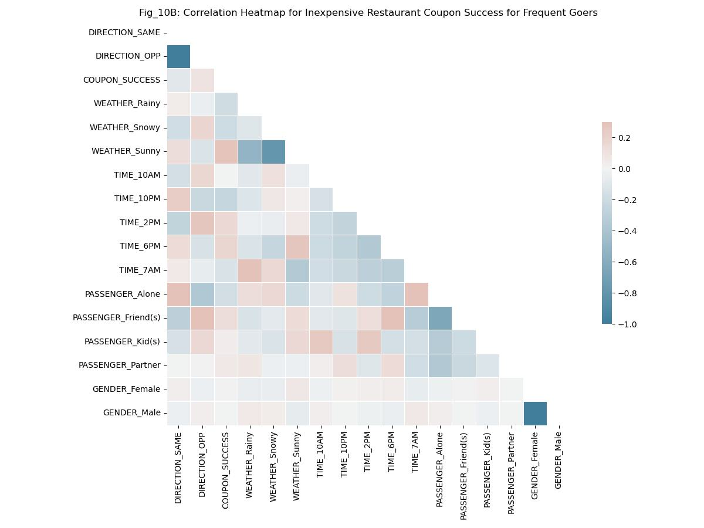

# Will a Customer Accept the Coupon?

## Harnessing the Power of BI Analytics: An Exploration using Correlation Matrices, Python DataFrame Queries and Visualization Tools

## 1. Introduction

In the dynamic landscape of today's consumer market, understanding customer behavior is paramount. A coupon is a great excuse to communicate with a customer, dramatize timely opportunities and promote new or popular products. [In 2019, 92% of consumers used coupons when shopping, according to a Statista survey of 1,000 people.](https://www.forbes.com/sites/forbestechcouncil/2020/10/08/five-ways-coupons-can-help-your-business-attract-loyal-customers/) So coupons and the acceptance thereof is serious business.

This project delves into the intriguing question of what influences a driver's decision to accept a coupon delivered to their cell phone while on the road based on geofencing triggers. Is it the type of establishment - a restaurant, a bar, or a coffee house? Does the presence of passengers, the weather, or the time of day sway the decision?

To unravel these complexities, we embark on an exploratory journey through a rich dataset sourced from the [UCI Machine Learning repository, collected via a survey on Amazon Mechanical Turk.](https://archive.ics.uci.edu/dataset/603/in+vehicle+coupon+recommendation) The survey captures a variety of driving scenarios and the driver's decision to accept or reject a coupon under those circumstances.

Our analysis employs a systematic approach, beginning with a comparative study of different coupons using bar plots. This visual exploration aids in discerning patterns and trends across coupon types. We then delve deeper, constructing a correlation matrix for coupon types to identify potential areas of interest. Finally, we perform targeted comparisons by querying the data, investigating how different combinations of features influence the coupon acceptance ratio. Some of the tools we'll use are descriptive statistics, one hot encoding, correlation heatmaps, pandas dataframe queries, and violin plots.

This project not only aims to distinguish between customers who accepted a driving coupon versus those who did not, but also seeks to provide insights that could inform targeted marketing strategies and enhance customer engagement. The findings from this analysis will be presented in a comprehensive report, highlighting key insights and actionable recommendations.

It is important to note that much more analysis is possible with this dataset. We had to make choices and explore certain scenarios in depth but not others. Specifically, we only looked at the Coffee House, Restaurant(<20) and Bar coupons. With a deeper dive on the Bar coupon.

## 2. Data Overview

The dataset used in this analysis is a rich collection of information detailing various driving scenarios and the driver's decision to accept or reject a coupon under those circumstances. The data, sourced from the UCI Machine Learning Repository, provides a comprehensive view of the factors that might influence a driver's decision to accept a coupon.

The dataset comprises three main categories of attributes:

### User Attributes

These attributes provide demographic information about the users, including their gender, age, marital status, number of children, education, occupation, and annual income. It also includes lifestyle information such as the frequency of visits to bars, coffee houses, and restaurants with an average expense of less than $20 per person.

### Contextual Attributes

These attributes describe the context in which the coupon was offered. They include the driving destination, the geographical location of the user, the coupon venue, and the destination. They also detail the weather conditions, temperature, time of day, and the presence of passengers in the vehicle.

### Coupon Attributes

These attributes provide information about the coupon itself, including the time before it expires.

This diverse set of attributes allows for a comprehensive analysis of the factors influencing a driver's decision to accept a coupon. The subsequent sections will delve into a detailed analysis of these attributes and their impact on coupon acceptance.

## 3. Methodology

Our approach to analyzing this dataset involved several key steps to ensure the data was clean, relevant, and ready for analysis.

### Data Cleaning

The first step in our methodology was data cleaning. This involved:

- **Removing columns with excessive missing data**: Columns with too many missing values can skew the analysis and lead to inaccurate results. We identified such columns and removed them from our dataset.
- **Handling null values**: We also dealt with null values in our dataset. Depending on the nature of the data and the extent of the null values, we either filled them with appropriate values or removed the rows containing these null values.
- **One-hot encoding**: For categorical variables, we used one-hot encoding. This technique transforms a category value into a new column and assigns a 1 or 0 (True/False) value to the column. This method is effective for handling categorical data without imposing an arbitrary order on the categories.

### Data Analysis Methodology

Once the data was cleaned, we moved on to the analysis phase. This involved:

- **Data Exploration**: We began our analysis by exploring the data using bar graphs. This helped us understand the distribution of different variables in our dataset and identify any noticeable trends or patterns.
- **Correlation Matrix**: We used a correlation matrix to understand the relationship between different variables in our dataset. This helped us identify patterns and trends in the data, and guided our subsequent analysis. We leveraged the Seaborn heatmap plots
- **Data Queries**: We performed targeted queries on our pandas dataframe to investigate specific combinations of features and their impact on coupon acceptance.

This systematic approach allowed us to thoroughly explore the dataset and derive meaningful insights from it.

## 4. Analysis

- Present the overall analysis of all the coupons compared to each other.

### Overall Analysis:

The key question of this data analysis is "Will a Customer Accept the Coupon?" and the answer is simply: "Yes! A majority of time the time (56.8%) coupons are succeding in being accepted by drivers and converting into meaningful business activity, but the acceptance rate greatly depends on a variety of circumstances." Any given coupon's performance - which we'll refer to as acceptance rate and coupon success henceforth - is greatly affect by weather, the direction the driver is headed (away from home or towards their home), how frequently they use that type of service etc. Throughout our analysis we describe some of these tendencies in greater detail. We've explored primarily the Bar coupons because those were underperforming when compared to other coupons. We'll explore how the data provides some specific insights using Jupyter Notebook, Pandas Dataframes and the Seaborn and Matplotlib data visualization libraries.

### Data Review and Cleanup

#### Dimensionality of the Data Set

The dataset under examination comprises 12,684 samples and 26 distinct features, providing a robust foundation for comprehensive analysis. The features are a mix of categorical and integer types. The majority of features have categorical data, which will at some points present issues that warrant the use of one hot encode.

The dataset’s multivariate nature allows for the investigation of relationships between multiple variables simultaneously, thereby enabling a more nuanced understanding of the underlying patterns. Given the substantial number of instances and the variety of features, this dataset provides ample opportunities for thorough exploration and analysis in the realm of business intelligence.

#### Missing Values

As described in the [Dataset documentation](https://archive.ics.uci.edu/dataset/603/in+vehicle+coupon+recommendation) the data was gathered using surveys by Amazon Mechanical Turk. Although the survey is very complete, when we plot for missing values we do find some issues nonetheless. See Fig_1:

#### Fig_1: Missing Value Ratio per Column (Sorted)

This figure provides a visual representation of the missing value ratio for each column in the dataset, sorted in descending order. It's clear from the plot that the 'Car' column has a significant amount of missing data, with approximately 99.14% of its values missing. This high percentage of missing values may impact the reliability of any analysis involving this column.

On the other hand, the columns 'CoffeeHouse', 'Restaurant20To50', 'CarryAway', 'RestaurantLessThan20', and 'Bar' have less than 10% of their values missing. This relatively low percentage of missing values suggests that these columns are more complete and may provide more reliable insights for analysis.

The missing value ratio is an important factor to consider during data cleaning and preprocessing, as it can significantly impact the results of the analysis.s.

#### Data Cleanup Steps

For the 'CoffeeHouse', 'Restaurant20To50', 'CarryAway', 'RestaurantLessThan20', 'Bar' it will suffice to replace the null values with the value "Unknown". By adding this value we leave the door open for a pattern to emerge for these unknown entries in future analysis, if there happend to be one. If for example a specific demographic disproportionately had a value set as "Unkonwn" there might be more going on.

The 'car' column on the other hand has more than 99% of data marked as null and is therefore not useful, so we will remove that column from the dataset. It might have been an issue with the user interface or form the user was presented with.

Additionally, I've standardized the titles to use snake case and all caps. Later in the analysis we'll use one hot encoding and the dummy columns will have all caps for the parent column name and Capitalized for the variant for example: "WEATHER_Snowy". This allows us to distinguish between original columns (in this case it was "WEATHER") and the variations thereof.

Finally, the acceptance of a coupon by a driver was called the "Y" column and that has been changed to "COUPON_SUCCESS" to be more descriptive.

### Initial Analysis

As an initial step we want to compare the average coupon success (or acceptance rate) of the different coupons. We can accomplish that by using a Seaborn bar plot.

#### Fig_2: Acceptance Rate of Different Types of Coupons

As observed in the data, Carry Out & Take Away is the most accepted type of coupon, followed by Restaurant(<20). This insight could be valuable for businesses in tailoring their coupon strategies to customer preferences.

You can also see the error bars for each coupon. These provide a visual representation of the statistical uncertainty or variability in the acceptance rate for each coupon type. The length of these lines indicates the range within which the true population mean is likely to fall, given the sample data. Seaborn's barplot function uses a 95% confidence interval.

In summary, the narrower the black rectangle (error bar), the more predictable or consistent the acceptance ratio is for that coupon type. As you can see, the 'Bar' coupon has the lowest acceptance rate and is also very unpredictable.

#### Statistical Description of Acceptance of Different Coupons

The descriptive statistics point to the fact that the "Coffee House" coupons have by far the highest accepted coupon count 3996, but the mean coupon acceptance rate is the highest in the in the "Carry out & Take away" coupons. The lowest count of accepted coupons is the "Restaurant(20-50)" coupon for more expensive restaurants, the lowest mean is the Bar coupon. If a coupon type has a high acceptance rate but not a high count that might mean that there is a business opportunity to compete in that particular service. Conversely, the opposite might mean the market is saturated. The fact that the standard deviation is highest for the Coffee House coupon further illustrates how the count of successes is high but the ratio of success is lower, there is more variation in the results for this coupon than the others. This could be an area for further investigation to understand the factors contributing to this variability.

| Stat  | Restaurant(<20) | Coffee House | Carry out & Take away | Bar         | Restaurant(20-50) |
| ----- | --------------- | ------------ | --------------------- | ----------- | ----------------- |
| count | 2786.000000     | 3996.000000  | 2393.000000           | 2017.000000 | 1492.000000       |
| mean  | 0.707107        | 0.499249     | 0.735478              | 0.410015    | 0.441019          |
| std   | 0.455171        | 0.500062     | 0.441170              | 0.491958    | 0.496676          |
| min   | 0.000000        | 0.000000     | 0.000000              | 0.000000    | 0.000000          |
| 25%   | 0.000000        | 0.000000     | 0.000000              | 0.000000    | 0.000000          |
| 50%   | 1.000000        | 0.000000     | 1.000000              | 0.000000    | 0.000000          |
| 75%   | 1.000000        | 1.000000     | 1.000000              | 1.000000    | 1.000000          |
| max   | 1.000000        | 1.000000     | 1.000000              | 1.000000    | 1.000000          |

#### Next Steps: Areas of Interest for our Exploration of the Data

Based on the insights of the Fig_2 and Statistical Description table we are going to focus on the "Coffee House", the "Restaurant(<20)" and the "Bar" coupons. There is much else that could be explored with this data, but in the interest of brevity we'll focus on these three. The "Coffee House" coupon is interesting because of the high standard deviation number, "Restaurant(<20)" is interesting because it is a high performer especially compared to "Restaurant(20-50)" and finally the "Bar" coupons perform badly and we want to eplore that part of the dataset to see if there are some possible reasons why.

In addition, our analysis will strategically focus on specific features of the dataset. For each coupon type, we will select a subset of columns from the dataframe that appear to hold potential for insightful findings. It’s important to note that this approach does not encompass an exhaustive analysis of all available data. Our objective is to efficiently utilize our resources to investigate potential relationships and derive meaningful insights.

### Correlation Analysis

A good first step in analyzing different features of a dataset is to check for correlations. Since our principal focus is coupon success we'll begin by visualizing the correlation of some features against coupon success for each of our target coupon types. Please note that hot one encoding has been used to turn categorical data into booleans (in 0, 1 format). This in turn allows us to better understand the correlations between for example sunny weather ("WHEATHER_Sunny") and the coupon acceptance rate.

#### Fig_10A: Correlation of Features with Inexpensive Restaurant Coupon Success for Frequent Goers

This graph compares the correlation between features and the coupon success for users that are already frequent inexpensive restaurant goers. As you can see sunny weather correlates strongly with coupon usage. Conversely, if the coupon is received after 10pm at night it is a lot less likely to convert. Interestingly, if a driver is going the opposite direction they are more likely to want to use a coupon. This might be because the they are going the opposite way might have to do with having a passanger onboard, or running some errand and thus needed to make alternate plans for a meal since home is becoming further away as they go. But, this also gives us a clue at another way to explore the data which is to look at the correlations of features with eachother. Even though we are ultimately interested in the relationships that lead to coupon success, by exploring how features influence eachother we could discover combinations that have a stronger correlation coefficient to coupon success than a single feature alone.

#### Fig_10B: Correlation Heatmap for Inexpensive Restaurant Coupon Success for Frequent Goers

This is a different visualization for the same population as Fib_10A. If we look at the above correlations we can see that the strongest correlations are obvious negative ones. For example PASSANGER_Friend(s) and PASSANGER_Alone are mutually exclusive, it isn't possible to have selected both. Hence they are dark blue.

Now for the more interesting patterns you see that when a driver has a kid(s) or a friend(s) in their car they are more likely to be going away from their house. Perhaps the reason to be driving away from home is to give them a ride to a destination or for an outing together. Additionally, it is more likely than not that the weather would be sunny under those conditions, since these values correlate with eachother. This leads us to a valuable business insight. There is a powerful combination of factors when its sunny, you have friend or kids in the car and you are going away from home, perhaps for a fun outing that deserves celebration at an inexpensive restaurant. Whatever the exact reasons might be (soccer practice commute, errand, theme park outing etc. ) there could be value in targetting drivers in this particular predicament with context appropriate personalized messaging.

One additional note is that the most popular times for coupon acceptance is 2pm and 6pm. Perhaps because drivers are about to get off of work or get ready for dinner.

#### Fig_11A: Correlation Heatmap for Bar Coupon Success for Frequent Bar-Goers

This figure examines the correlation coefficients for frequent bar-goers to assess their conversion rates under various conditions. As you can see, age plays a significant role. Drivers aged 21 and 26 are much more likely to convert. This trend changes dramatically for drivers in their 30s. Interestingly, the direction of travel has a different impact compared to the Restaurant(<20) coupons we previously reviewed. Drivers are much more likely to visit a bar if it’s on their route. Conversely, the likelihood of visiting a bar decreases if they are alone. If they are alone, there is a positive correlation with accepting the bar coupon. We will further query the data to explore these relationships in greater depth.

#### Fig_11B: Correlation Heatmap for Bar Coupon Success for Frequent Bar-Goers

Similar to Fig_10B, this heatmap allows us to examine correlations between different features, unveiling intriguing combinations.

For example, observe that drivers aged 50 or above are more likely to have a child in the car, which ultimately diminishes the likelihood of them accepting a coupon.

Interestingly, if a driver is 26 years old, they are more likely to receive the coupon (and thus be out driving) at 10pm at night. However, the coupon acceptance rate at 10pm is lower than usual, suggesting there may be additional factors at play.

In the queries section later in this report, we will conduct a deeper exploration into the relationships between passengers, time of day, weather, and more, with a particular focus on the “Bar” coupon. This in-depth analysis aims to shed further light on the factors influencing coupon acceptance.

- Discuss the correlation matrix for the Bar, Inexpensive Restaurant, and Coffee House coupons.
- Deep dive into the bar coupons and specific populations. Discuss how their coupon acceptance ratio differs from other users.

## 5. Findings

- Clearly state the problem for the specific coupon group.
- Present visualizations that demonstrate exploring differences in those who accepted and rejected the coupon.
- Interpret the descriptive and inferential statistics in a concise manner.
- Highlight actionable items in their own section.

## 6. Conclusion and Recommendations

- Summarize the key findings from your analysis.
- Provide recommendations based on your findings.
- Discuss potential next steps or further analyses that could be done.

## 7. References

- Cite any external sources used in your analysis.
  In-Vehicle Coupon Recommendation. (2020). UCI Machine Learning Repository. https://doi.org/10.24432/C5GS4P.
